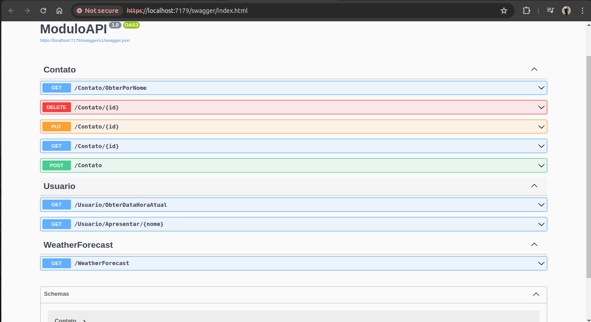

<h1 align="center">CRUD de .NET e C# Utilizando Entity Framework</h1>

  <a href="#-tecnologias">Tecnologias</a>&nbsp;&nbsp;&nbsp;|&nbsp;&nbsp;&nbsp;
  <a href="#-projeto">Projeto</a>&nbsp;&nbsp;&nbsp;|&nbsp;&nbsp;&nbsp;
  <a href="#-layout">Layout</a>&nbsp;&nbsp;&nbsp;

  

 

  

## 🛠 Tecnologias

Esse projeto foi desenvolvido com as seguintes tecnologias:

- .NET, C#
- ENTITY FRAMEWORK
- Git & Github

## 💻 Projeto

Feito com ♥ by Natã Pires :wave: [Entre em contato pelo Linkedln](https://www.linkedin.com/in/nat%C3%A3-pires-ferreira-7062281a0/)
